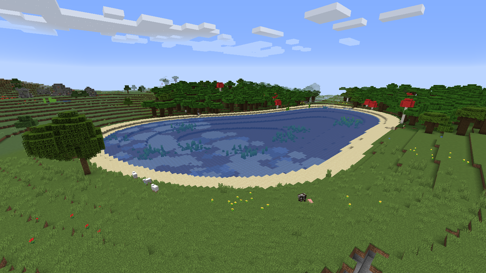

# SimpleWorldGenerator
A simple world generator for Bukkit servers.

## Requirements
 - Java 8
 - Bukkit (or any fork of it) 1.13+ (tested on Tuinity 1.15.2, your results may vary) 

## How to use?
Open your server's `bukkit.yml` and add this to the bottom, replacing `<world>` with your world's name (without brackets!)
```yml
worlds:
  <world>:
    generator: SimpleWorldGenerator
```

## Other configuration?
None! This plugin is a simple plug-and-play replacement for Minecraft's vanilla world generator, with some nice-looking results.



## Known issues
Don't know yet.

## Known wontfix issues
 - Villages spawning in air (wontfix because decoration spawning is handled by Minecraft's world generation, and it probably expects the terrain to be higher or lower)

